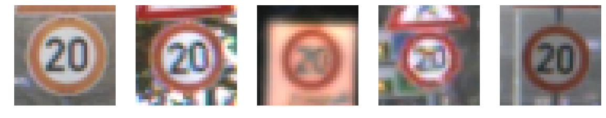
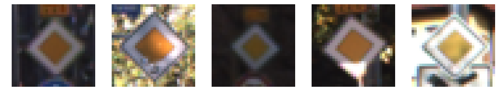
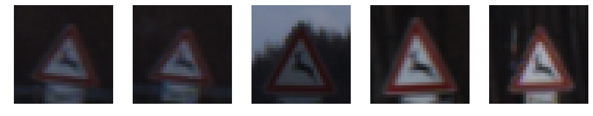

(writeup/output_
# Self-Driving Car Engineer Nanodegree

## Deep Learning

## Project: Build a Traffic Sign Recognition Classifier

---
## Step 0: Load The Data


```python
# Load pickled data
import pickle
import glob
import cv2
import numpy as np
import pandas as pd
import matplotlib.pyplot as plt
import scipy as sp
import tensorflow as tf
import matplotlib.image as mpimg
from sklearn.model_selection import train_test_split
from sklearn.utils import shuffle
from tensorflow.contrib.layers import flatten
%matplotlib inline
```


```python
training_file = 'data/train.p'
validation_file = 'data/valid.p'
testing_file = 'data/test.p'

with open(training_file, mode='rb') as f:
    train = pickle.load(f)
with open(validation_file, mode='rb') as f:
    valid = pickle.load(f)
with open(testing_file, mode='rb') as f:
    test = pickle.load(f)

X_train, y_train = train['features'], train['labels']
X_valid, y_valid = valid['features'], valid['labels']
X_test, y_test = test['features'], test['labels']
```

---

## Step 1: Dataset Summary & Exploration

### Provide a Basic Summary of the Data Set Using Python, Numpy and/or Pandas


```python
### Replace each question mark with the appropriate value.
### Use python, pandas or numpy methods rather than hard coding the results

# TODO: Number of training examples
n_train = len(X_train)

# TODO: Number of validation examples
n_validation = len(X_valid)

# TODO: Number of testing examples.
n_test = len(X_test)

# TODO: What's the shape of an traffic sign image?
image_shape = X_train[0].shape

# TODO: How many unique classes/labels there are in the dataset.
n_classes = len(set(y_train))

print("Number of training examples =", n_train)
print("Number of testing examples =", n_test)
print("Image data shape =", image_shape)
print("Number of classes =", n_classes)
```

    Number of training examples = 34799
    Number of testing examples = 12630
    Image data shape = (32, 32, 3)
    Number of classes = 43


### Include an exploratory visualization of the dataset

The dataset contains 34799 training examples of German street signs with 43 different classes. The test set has a total of 12630 examples. The images have a dimension of 32x32 pixels and 3 colors. Below is a table of the labels mapped to sign names.


```python
sign_names = pd.read_csv('signnames.csv', index_col='ClassId')
sign_names
```


<div>
<style>
    .dataframe thead tr:only-child th {
        text-align: right;
    }

    .dataframe thead th {
        text-align: left;
    }

    .dataframe tbody tr th {
        vertical-align: top;
    }
</style>
<table border="1" class="dataframe">
  <thead>
    <tr style="text-align: right;">
      <th></th>
      <th>SignName</th>
    </tr>
    <tr>
      <th>ClassId</th>
      <th></th>
    </tr>
  </thead>
  <tbody>
    <tr>
      <th>0</th>
      <td>Speed limit (20km/h)</td>
    </tr>
    <tr>
      <th>1</th>
      <td>Speed limit (30km/h)</td>
    </tr>
    <tr>
      <th>2</th>
      <td>Speed limit (50km/h)</td>
    </tr>
    <tr>
      <th>3</th>
      <td>Speed limit (60km/h)</td>
    </tr>
    <tr>
      <th>4</th>
      <td>Speed limit (70km/h)</td>
    </tr>
    <tr>
      <th>5</th>
      <td>Speed limit (80km/h)</td>
    </tr>
    <tr>
      <th>6</th>
      <td>End of speed limit (80km/h)</td>
    </tr>
    <tr>
      <th>7</th>
      <td>Speed limit (100km/h)</td>
    </tr>
    <tr>
      <th>8</th>
      <td>Speed limit (120km/h)</td>
    </tr>
    <tr>
      <th>9</th>
      <td>No passing</td>
    </tr>
    <tr>
      <th>10</th>
      <td>No passing for vehicles over 3.5 metric tons</td>
    </tr>
    <tr>
      <th>11</th>
      <td>Right-of-way at the next intersection</td>
    </tr>
    <tr>
      <th>12</th>
      <td>Priority road</td>
    </tr>
    <tr>
      <th>13</th>
      <td>Yield</td>
    </tr>
    <tr>
      <th>14</th>
      <td>Stop</td>
    </tr>
    <tr>
      <th>15</th>
      <td>No vehicles</td>
    </tr>
    <tr>
      <th>16</th>
      <td>Vehicles over 3.5 metric tons prohibited</td>
    </tr>
    <tr>
      <th>17</th>
      <td>No entry</td>
    </tr>
    <tr>
      <th>18</th>
      <td>General caution</td>
    </tr>
    <tr>
      <th>19</th>
      <td>Dangerous curve to the left</td>
    </tr>
    <tr>
      <th>20</th>
      <td>Dangerous curve to the right</td>
    </tr>
    <tr>
      <th>21</th>
      <td>Double curve</td>
    </tr>
    <tr>
      <th>22</th>
      <td>Bumpy road</td>
    </tr>
    <tr>
      <th>23</th>
      <td>Slippery road</td>
    </tr>
    <tr>
      <th>24</th>
      <td>Road narrows on the right</td>
    </tr>
    <tr>
      <th>25</th>
      <td>Road work</td>
    </tr>
    <tr>
      <th>26</th>
      <td>Traffic signals</td>
    </tr>
    <tr>
      <th>27</th>
      <td>Pedestrians</td>
    </tr>
    <tr>
      <th>28</th>
      <td>Children crossing</td>
    </tr>
    <tr>
      <th>29</th>
      <td>Bicycles crossing</td>
    </tr>
    <tr>
      <th>30</th>
      <td>Beware of ice/snow</td>
    </tr>
    <tr>
      <th>31</th>
      <td>Wild animals crossing</td>
    </tr>
    <tr>
      <th>32</th>
      <td>End of all speed and passing limits</td>
    </tr>
    <tr>
      <th>33</th>
      <td>Turn right ahead</td>
    </tr>
    <tr>
      <th>34</th>
      <td>Turn left ahead</td>
    </tr>
    <tr>
      <th>35</th>
      <td>Ahead only</td>
    </tr>
    <tr>
      <th>36</th>
      <td>Go straight or right</td>
    </tr>
    <tr>
      <th>37</th>
      <td>Go straight or left</td>
    </tr>
    <tr>
      <th>38</th>
      <td>Keep right</td>
    </tr>
    <tr>
      <th>39</th>
      <td>Keep left</td>
    </tr>
    <tr>
      <th>40</th>
      <td>Roundabout mandatory</td>
    </tr>
    <tr>
      <th>41</th>
      <td>End of no passing</td>
    </tr>
    <tr>
      <th>42</th>
      <td>End of no passing by vehicles over 3.5 metric ...</td>
    </tr>
  </tbody>
</table>
</div>


5 examples for each of the 43 classes


```python
for i in sorted(set(y_train)):
    print("Class ID: {}, Name: {}".format(i, sign_names.iloc[i]['SignName']))
    X_train_, y_train_ = shuffle(X_train, y_train)
    f, ax = plt.subplots(1, 5, figsize=(20,10))
    for image, i in zip(X_train_[y_train_ == i], range(5)):
        ax[i].imshow(image)
        ax[i].set_axis_off()
    plt.show()
```

    Class ID: 0, Name: Speed limit (20km/h)





    Class ID: 1, Name: Speed limit (30km/h)


    Class ID: 2, Name: Speed limit (50km/h)


    Class ID: 3, Name: Speed limit (60km/h)


    Class ID: 4, Name: Speed limit (70km/h)


    Class ID: 5, Name: Speed limit (80km/h)


    Class ID: 6, Name: End of speed limit (80km/h)


    Class ID: 7, Name: Speed limit (100km/h)


    Class ID: 8, Name: Speed limit (120km/h)


    Class ID: 9, Name: No passing


    Class ID: 10, Name: No passing for vehicles over 3.5 metric tons


    Class ID: 11, Name: Right-of-way at the next intersection


    Class ID: 12, Name: Priority road





    Class ID: 13, Name: Yield


    Class ID: 14, Name: Stop


    Class ID: 15, Name: No vehicles


    Class ID: 16, Name: Vehicles over 3.5 metric tons prohibited


    Class ID: 17, Name: No entry


    Class ID: 18, Name: General caution


    Class ID: 19, Name: Dangerous curve to the left


    Class ID: 20, Name: Dangerous curve to the right


    Class ID: 21, Name: Double curve


    Class ID: 22, Name: Bumpy road


    Class ID: 23, Name: Slippery road


    Class ID: 24, Name: Road narrows on the right


    Class ID: 25, Name: Road work


    Class ID: 26, Name: Traffic signals


    Class ID: 27, Name: Pedestrians


    Class ID: 28, Name: Children crossing


    Class ID: 29, Name: Bicycles crossing


    Class ID: 30, Name: Beware of ice/snow


    Class ID: 31, Name: Wild animals crossing





    Class ID: 32, Name: End of all speed and passing limits


    Class ID: 33, Name: Turn right ahead


    Class ID: 34, Name: Turn left ahead


    Class ID: 35, Name: Ahead only


    Class ID: 36, Name: Go straight or right


    Class ID: 37, Name: Go straight or left


    Class ID: 38, Name: Keep right


    Class ID: 39, Name: Keep left


    Class ID: 40, Name: Roundabout mandatory


    Class ID: 41, Name: End of no passing


    Class ID: 42, Name: End of no passing by vehicles over 3.5 metric tons


Distribution of classes in training set. Difference is quite high. Max occurrences is label 2 with 2010 examples, least common is label 0, 19 and 37 all with only 180 occurrences. So an order of magnitude difference between most and least common.


```python
from collections import Counter
label_count = Counter(y_train)
uniq_labels = sorted(set(y_train))
label_height = []
for i in uniq_labels:
    label_height.append(label_count[i])
plt.bar(uniq_labels, label_height)
plt.show()
print(label_count)
```


    Counter({2: 2010, 1: 1980, 13: 1920, 12: 1890, 38: 1860, 10: 1800, 4: 1770, 5: 1650, 25: 1350, 9: 1320, 7: 1290, 3: 1260, 8: 1260, 11: 1170, 18: 1080, 35: 1080, 17: 990, 14: 690, 31: 690, 33: 599, 15: 540, 26: 540, 28: 480, 23: 450, 30: 390, 6: 360, 16: 360, 34: 360, 22: 330, 36: 330, 20: 300, 40: 300, 21: 270, 39: 270, 24: 240, 29: 240, 27: 210, 32: 210, 41: 210, 42: 210, 0: 180, 19: 180, 37: 180})


----

## Step 2: Design and Test a Model Architecture

### Pre-process the Data Set (normalization, grayscale, etc.)

## Image pre-processing pipeline

First I convert the image to grayscale. I found that this worked well empirically, and also it is closer to the original LeNet architecture.
Then I add some modified (fake) training examples
- Rotated images 10 and 20 degrees clockwise and counter-clockwise
- Mirrored images
- Blurred images
- Noisy images

I do this to give the models more examples of each of the classes.
Lastly I normalize the data to get a (close to) zero mean


```python
def convert_gray(X):
    X_ = []
    for x in X:
        X_.append(cv2.cvtColor(x, cv2.COLOR_RGB2GRAY))
    return np.array(X_)

def blur(X, y, kernel_size=5):
    X_ = []
    y_ = []
    for i in range(len(X)):
        X_.append(cv2.GaussianBlur(X[i], (kernel_size, kernel_size), 0))
        y_.append(y[i])
    return X_, y_

def rotate(X, y, angle=10):
    X_ = []
    y_ = []
    for i in range(len(X)):
        X_.append(sp.ndimage.interpolation.rotate(X[i], angle, reshape=False, mode='nearest'))
        y_.append(y[i])
    return X_, y_

def noise(X, y, mu=0, s=0.1):
    X_ = []
    y_ = []
    img_size = X.shape
    for i in range(len(X)):
        n = np.random.normal(mu, s, img_size[1]*img_size[2]).reshape(img_size[1:])
        X_.append(X[i]+n)
        y_.append(y[i])
    return X_, y_

def flip_x(X, y):
    X_ = []
    y_ = []
    for i in range(len(X)):
        X_.append(np.fliplr(X[i]))
        y_.append(y[i])
    return X_, y_

def normalize(x):
    return (np.float32(x)-128)/128
```


```python
def extra_examples(X_train, y_train):
    X_extra = []
    y_extra = []

    X_extra_tmp, y_extra_tmp = rotate(X_train, y_train, 10)
    X_extra += X_extra_tmp
    y_extra += y_extra_tmp

    X_extra_tmp, y_extra_tmp = rotate(X_train, y_train, -10)
    X_extra += X_extra_tmp
    y_extra += y_extra_tmp

    X_extra_tmp, y_extra_tmp = rotate(X_train, y_train, 20)
    X_extra += X_extra_tmp
    y_extra += y_extra_tmp

    X_extra_tmp, y_extra_tmp = rotate(X_train, y_train, -20)
    X_extra += X_extra_tmp
    y_extra += y_extra_tmp

    X_extra_tmp, y_extra_tmp = noise(X_train, y_train)
    X_extra += X_extra_tmp
    y_extra += y_extra_tmp

    X_extra_tmp, y_extra_tmp = flip_x(X_train, y_train)
    X_extra += X_extra_tmp
    y_extra += y_extra_tmp

    X_extra_tmp, y_extra_tmp = blur(X_train, y_train)
    X_extra += X_extra_tmp
    y_extra += y_extra_tmp

    X_train = np.concatenate((X_train, X_extra), axis=0)
    y_train = np.concatenate((y_train, y_extra), axis=0)

    return X_train, y_train
```


```python
def pipeline(X, y, extra=False):
    X = convert_gray(X)
    if extra:
        X, y = extra_examples(X, y)
    X = normalize(X)
    X = np.reshape(X, (X.shape[0], X.shape[1], X.shape[2], 1))
    return X, y
```


```python
X_train, y_train = pipeline(X_train, y_train, extra=True)
X_valid, y_valid = pipeline(X_valid, y_valid)
X_test, y_test = pipeline(X_test, y_test)
```


```python
X_train, y_train = shuffle(X_train, y_train)
```

### Model Architecture

The model architecture is the same as in the LeNet lab. I added dropout after the first fully connected layer with a dropout rate of 0.5. The weight initialization parameters mu and sigma in the LeNet architecture is set to 0 and 0.1. All layers have a ReLU activation function except the last one which uses Softmax.

The layers of the architecture:

- Convolutional layer, 5x5 filter, input depth 1, output depth 6
- Max Pooling, 2x2 kernel, 2x2 stride
- Convolutional layer, 5x5 filter, input depth 6, output depth 16
- Max pooling 2x2 kernel, 2x2 stride
- Flatten
- Fully connected layer, 120 width
- Dropout, keep probability 0.5
- Fully connected layer, 84 width
- Fully connected layer, 43 width

More information about each layer can be seen below


```python
EPOCHS = 40
BATCH_SIZE = 128
```


```python
def LeNet(x):    
    # Arguments used for tf.truncated_normal, randomly defines variables for the weights and biases for each layer
    mu = 0
    sigma = 0.1

    # SOLUTION: Layer 1: Convolutional. Input = 32x32x1. Output = 28x28x6.
    conv1_W = tf.Variable(tf.truncated_normal(shape=(5, 5, 1, 6), mean = mu, stddev = sigma))
    conv1_b = tf.Variable(tf.zeros(6))
    conv1   = tf.nn.conv2d(x, conv1_W, strides=[1, 1, 1, 1], padding='VALID') + conv1_b

    # SOLUTION: Activation.
    conv1 = tf.nn.relu(conv1)

    # SOLUTION: Pooling. Input = 28x28x6. Output = 14x14x6.
    conv1 = tf.nn.max_pool(conv1, ksize=[1, 2, 2, 1], strides=[1, 2, 2, 1], padding='VALID')

    # SOLUTION: Layer 2: Convolutional. Output = 10x10x16.
    conv2_W = tf.Variable(tf.truncated_normal(shape=(5, 5, 6, 16), mean = mu, stddev = sigma))
    conv2_b = tf.Variable(tf.zeros(16))
    conv2   = tf.nn.conv2d(conv1, conv2_W, strides=[1, 1, 1, 1], padding='VALID') + conv2_b

    # SOLUTION: Activation.
    conv2 = tf.nn.relu(conv2)

    # SOLUTION: Pooling. Input = 10x10x16. Output = 5x5x16.
    conv2 = tf.nn.max_pool(conv2, ksize=[1, 2, 2, 1], strides=[1, 2, 2, 1], padding='VALID')

    # SOLUTION: Flatten. Input = 5x5x16. Output = 400.
    fc0   = flatten(conv2)

    # SOLUTION: Layer 3: Fully Connected. Input = 400. Output = 120.
    fc1_W = tf.Variable(tf.truncated_normal(shape=(400, 120), mean = mu, stddev = sigma))
    fc1_b = tf.Variable(tf.zeros(120))
    fc1   = tf.matmul(fc0, fc1_W) + fc1_b

    # SOLUTION: Activation.
    fc1    = tf.nn.relu(fc1)

    # DROPOUT    ####
    keep_prob = tf.placeholder(tf.float32)
    fc1_drop = tf.nn.dropout(fc1, keep_prob)

    # SOLUTION: Layer 4: Fully Connected. Input = 120. Output = 84.
    fc2_W  = tf.Variable(tf.truncated_normal(shape=(120, 84), mean = mu, stddev = sigma))
    fc2_b  = tf.Variable(tf.zeros(84))
    fc2    = tf.matmul(fc1_drop, fc2_W) + fc2_b   ####

    # SOLUTION: Activation.
    fc2    = tf.nn.relu(fc2)

    # SOLUTION: Layer 5: Fully Connected. Input = 84. Output = 10.
    fc3_W  = tf.Variable(tf.truncated_normal(shape=(84, 43), mean = mu, stddev = sigma))
    fc3_b  = tf.Variable(tf.zeros(43))
    logits = tf.matmul(fc2, fc3_W) + fc3_b

    return logits, keep_prob
```


```python
x = tf.placeholder(tf.float32, (None, 32, 32, 1))
y = tf.placeholder(tf.int32, (None))
one_hot_y = tf.one_hot(y, 43)
```

### Train, Validate and Test the Model

A validation set can be used to assess how well the model is performing. A low accuracy on the training and validation
sets imply underfitting. A high accuracy on the training set but low accuracy on the validation set implies overfitting.

The Adam optimizer is used when training the network. The learning rate is set to 0.001. I run 40 epochs with a batch size of 128.


```python
rate = 0.001

logits, keep_prob = LeNet(x)
cross_entropy = tf.nn.softmax_cross_entropy_with_logits(labels=one_hot_y, logits=logits)
loss_operation = tf.reduce_mean(cross_entropy)
optimizer = tf.train.AdamOptimizer(learning_rate = rate)
training_operation = optimizer.minimize(loss_operation)
```

## Evaluate model


```python
correct_prediction = tf.equal(tf.argmax(logits, 1), tf.argmax(one_hot_y, 1))
accuracy_operation = tf.reduce_mean(tf.cast(correct_prediction, tf.float32))
saver = tf.train.Saver()

def evaluate(X_data, y_data):
    num_examples = len(X_data)
    total_accuracy = 0
    sess = tf.get_default_session()
    for offset in range(0, num_examples, BATCH_SIZE):
        batch_x, batch_y = X_data[offset:offset+BATCH_SIZE], y_data[offset:offset+BATCH_SIZE]
        accuracy = sess.run(accuracy_operation, feed_dict={x: batch_x, y: batch_y, keep_prob: 1.0})
        total_accuracy += (accuracy * len(batch_x))
    return total_accuracy / num_examples
```


```python
with tf.Session() as sess:
    sess.run(tf.global_variables_initializer())
    num_examples = len(X_train)

    print("Training...")
    print()
    for i in range(EPOCHS):
        X_train, y_train = shuffle(X_train, y_train)
        for offset in range(0, num_examples, BATCH_SIZE):
            end = offset + BATCH_SIZE
            batch_x, batch_y = X_train[offset:end], y_train[offset:end]
            sess.run(training_operation, feed_dict={x: batch_x, y: batch_y, keep_prob: 0.5})

        test_accuracy = evaluate(X_train, y_train)
        validation_accuracy = evaluate(X_valid, y_valid)
        print("EPOCH {} ...".format(i+1))
        print("Test Accuracy = {:.3f}".format(test_accuracy))
        print("Validation Accuracy = {:.3f}".format(validation_accuracy))
        print()

    saver.save(sess, './lenet')
    print("Model saved")
```

    Training...

    EPOCH 1 ...
    Test Accuracy = 0.919
    Validation Accuracy = 0.903

    EPOCH 2 ...
    Test Accuracy = 0.956
    Validation Accuracy = 0.936

    EPOCH 3 ...
    Test Accuracy = 0.967
    Validation Accuracy = 0.940

    EPOCH 4 ...
    Test Accuracy = 0.975
    Validation Accuracy = 0.950

    EPOCH 5 ...
    Test Accuracy = 0.980
    Validation Accuracy = 0.958

    EPOCH 6 ...
    Test Accuracy = 0.983
    Validation Accuracy = 0.959

    EPOCH 7 ...
    Test Accuracy = 0.984
    Validation Accuracy = 0.961

    EPOCH 8 ...
    Test Accuracy = 0.984
    Validation Accuracy = 0.954

    EPOCH 9 ...
    Test Accuracy = 0.986
    Validation Accuracy = 0.956

    EPOCH 10 ...
    Test Accuracy = 0.987
    Validation Accuracy = 0.961

    EPOCH 11 ...
    Test Accuracy = 0.988
    Validation Accuracy = 0.961

    EPOCH 12 ...
    Test Accuracy = 0.987
    Validation Accuracy = 0.954

    EPOCH 13 ...
    Test Accuracy = 0.990
    Validation Accuracy = 0.956

    EPOCH 14 ...
    Test Accuracy = 0.989
    Validation Accuracy = 0.961

    EPOCH 15 ...
    Test Accuracy = 0.988
    Validation Accuracy = 0.956

    EPOCH 16 ...
    Test Accuracy = 0.991
    Validation Accuracy = 0.963

    EPOCH 17 ...
    Test Accuracy = 0.992
    Validation Accuracy = 0.965

    EPOCH 18 ...
    Test Accuracy = 0.992
    Validation Accuracy = 0.963

    EPOCH 19 ...
    Test Accuracy = 0.992
    Validation Accuracy = 0.964

    EPOCH 20 ...
    Test Accuracy = 0.991
    Validation Accuracy = 0.956

    EPOCH 21 ...
    Test Accuracy = 0.993
    Validation Accuracy = 0.961

    EPOCH 22 ...
    Test Accuracy = 0.993
    Validation Accuracy = 0.964

    EPOCH 23 ...
    Test Accuracy = 0.993
    Validation Accuracy = 0.962

    EPOCH 24 ...
    Test Accuracy = 0.992
    Validation Accuracy = 0.963

    EPOCH 25 ...
    Test Accuracy = 0.993
    Validation Accuracy = 0.965

    EPOCH 26 ...
    Test Accuracy = 0.993
    Validation Accuracy = 0.959

    EPOCH 27 ...
    Test Accuracy = 0.994
    Validation Accuracy = 0.957

    EPOCH 28 ...
    Test Accuracy = 0.993
    Validation Accuracy = 0.954

    EPOCH 29 ...
    Test Accuracy = 0.993
    Validation Accuracy = 0.959

    EPOCH 30 ...
    Test Accuracy = 0.993
    Validation Accuracy = 0.962

    EPOCH 31 ...
    Test Accuracy = 0.994
    Validation Accuracy = 0.963

    EPOCH 32 ...
    Test Accuracy = 0.995
    Validation Accuracy = 0.971

    EPOCH 33 ...
    Test Accuracy = 0.994
    Validation Accuracy = 0.966

    EPOCH 34 ...
    Test Accuracy = 0.994
    Validation Accuracy = 0.960

    EPOCH 35 ...
    Test Accuracy = 0.991
    Validation Accuracy = 0.962

    EPOCH 36 ...
    Test Accuracy = 0.995
    Validation Accuracy = 0.961

    EPOCH 37 ...
    Test Accuracy = 0.992
    Validation Accuracy = 0.953

    EPOCH 38 ...
    Test Accuracy = 0.994
    Validation Accuracy = 0.965

    EPOCH 39 ...
    Test Accuracy = 0.993
    Validation Accuracy = 0.963

    EPOCH 40 ...
    Test Accuracy = 0.995
    Validation Accuracy = 0.965

    Model saved


### Accuracy on test set


```python
with tf.Session() as sess:
    sess.run(tf.global_variables_initializer())
    saver.restore(sess, './lenet')
    train_accuracy = evaluate(X_train, y_train)
    validation_accuracy = evaluate(X_valid, y_valid)
    test_accuracy = evaluate(X_test, y_test)
    print("Train Accuracy = {:.3f}".format(train_accuracy))
    print("Validation Accuracy = {:.3f}".format(validation_accuracy))
    print("Test Accuracy = {:.3f}".format(test_accuracy))
    print()
```

    INFO:tensorflow:Restoring parameters from ./lenet
    Train Accuracy = 0.995
    Validation Accuracy = 0.965
    Test Accuracy = 0.938


## Solution approach

Training is run for `EPOCHS` epochs. In this case 40. In each epoch the training data is split into batch sizes with `BATCH_SIZE` in each. We use batches so we don't run into memory issues.

The model is trained by optimizing for the minimum cross entropy between the one hot encoding and the logits using the Adam optimizer.

After training is done the model is saved and the accuracy printed.

I think the LeNet architecture works well because the tasks are quite similar. We are trying to recognize symbols that are cropped and resized to a standard size. Traffic signs of the same class are usually identical, and even with noise and blur they are easy to recognize.

---

## Step 3: Test a Model on New Images

### Load and Output the Images

These images were taken from Google street view in two German cities. They are all clearly visible, under great lightning conditions, with only one sign visible. The images are taken facing the sign, as opposed to from the side. These are all optimal conditions where the new images are very similar to the training examples. I don't expect the model to have a lot of difficulties in correctly classifying the images.


```python
def resize(image):
    return cv2.resize(image, (32, 32))
```


```python
wild = []
wild_filenames = [1, 13, 17, 25, 26, 38]
y_wild = wild_filenames
folder = 'wild'
for filename in wild_filenames:
    path = '{}/{}.jpg'.format(folder, filename)
    image = mpimg.imread(path)
    image_32 = resize(image)
    wild.append(image_32)
    f, ax = plt.subplots(1, 1, figsize=(2,2))
    ax.set_title(filename)
    ax.imshow(image_32)
    plt.show()
```


```python
wild_gray = convert_gray(wild)
for image in wild_gray:
    plt.imshow(image, cmap='gray')
    plt.show()
```


```python
X_wild = normalize(wild_gray)
X_wild = np.reshape(X_wild, (X_wild.shape[0], X_wild.shape[1], X_wild.shape[2], 1))
```

### Predict the Sign Type for Each Image


```python
with tf.Session() as sess:
    sess.run(tf.global_variables_initializer())
    saver.restore(sess, './lenet')
    prediction = tf.argmax(tf.nn.softmax(logits),1)
    wild_predictions = sess.run(prediction, feed_dict={x: X_wild, keep_prob: 1.0})
    wild_softmax = sess.run(tf.nn.softmax(logits), feed_dict={x: X_wild, keep_prob: 1.0})
    print("Labels:     ", np.array(y_wild))
    print("Predictions:", wild_predictions)
    wild_accuracy = evaluate(X_wild, y_wild)
    print("Accuracy = {:.3f}".format(wild_accuracy))
    print()
```

    INFO:tensorflow:Restoring parameters from ./lenet
    Labels:      [ 1 13 17 25 26 38]
    Predictions: [ 1 13 17 25 26 38]
    Accuracy = 1.000


### Analyze Performance


```python
### Calculate the accuracy for these 5 new images.
### For example, if the model predicted 1 out of 5 signs correctly, it's 20% accurate on these new images.
print(wild_predictions)
wild_accuracy_percent = np.sum(y_true == y_pred for y_true, y_pred in zip(y_wild, wild_predictions))/len(y_wild)*100
print("Accuracy: {}%".format(wild_accuracy_percent))
```

    [ 1 13 17 25 26 38]
    Accuracy: 100.0%


Accuracy is 100%, which is close to the 96% on the validation set and 94% on the test set. We have very few images, only 5 here. Also, the images are of very good condition. Some of the images in the train/valid/test set are quite difficult to classify, even for a human. If we had more images, and some more trickier ones like in the dataset I'd expect to see probabilities closer to that of the validation and test sets.

### Output Top 5 Softmax Probabilities For Each Image Found on the Web


```python
with tf.Session() as sess:
    res = sess.run(tf.nn.top_k(tf.constant(wild_softmax), k=5))
    print(res)
```

    TopKV2(values=array([[  1.00000000e+00,   2.28718040e-08,   6.85952545e-11,
              1.11062700e-12,   4.96197220e-14],
           [  9.99999642e-01,   3.66421602e-07,   1.51958349e-10,
              4.53232903e-11,   1.17679859e-11],
           [  1.00000000e+00,   2.70628036e-22,   3.48335732e-24,
              1.48456991e-25,   2.85569312e-26],
           [  1.00000000e+00,   1.69425357e-12,   1.32461425e-13,
              1.59967356e-14,   1.20910491e-15],
           [  7.97606230e-01,   2.00077027e-01,   2.26274459e-03,
              4.49248982e-05,   4.77592948e-06],
           [  9.99999404e-01,   6.18118463e-07,   1.96800990e-14,
              1.84696974e-14,   2.39388261e-15]], dtype=float32), indices=array([[ 1,  5,  2,  4,  6],
           [13, 12, 15,  5, 35],
           [17, 34, 38, 33, 26],
           [25, 22, 20, 24, 21],
           [26, 18, 25, 24, 11],
           [38, 39, 10, 31, 37]], dtype=int32))


The model is very certain about each of the predictions. Essentially 100% for each of the predictions.
